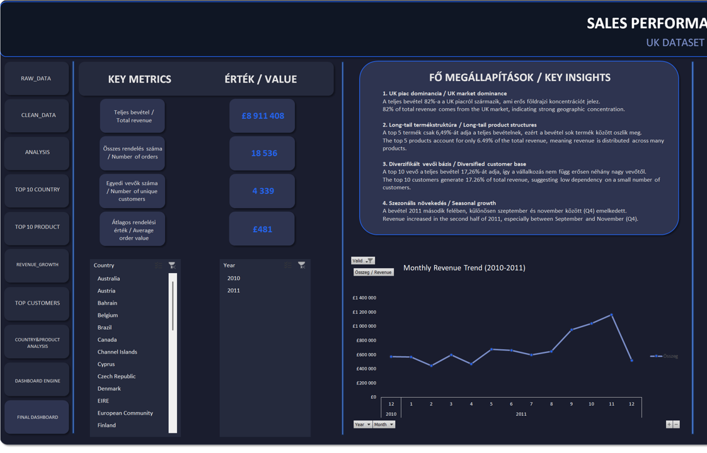
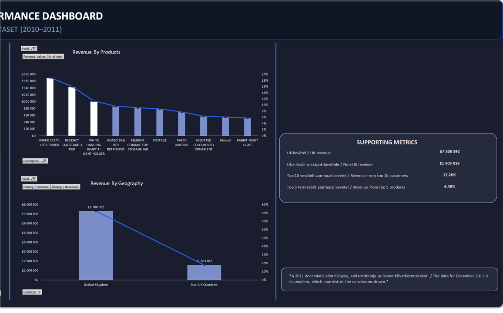

# 📊 Projektmunka 1 – UK Dataset Analysis

🇭🇺 Magyar verzió  
Scroll down for English 🇬🇧

---

## 🎯 Projekt célja

A projekt célja egy nagyméretű (500 000+ soros) e-kereskedelmi adathalmaz elemzése volt Excel segítségével, a főbb üzleti teljesítménymutatók (KPI-ok) meghatározásával, valamint egy interaktív dashboard készítésével a döntéshozatal támogatása érdekében.

---

## 🛠 Használt eszközök

- Microsoft Excel
- Pivot táblák
- Szeletelők 
- Függvények:
  - SZUMHA, SZUMHATÖBB, DARABHA, ÁTLAG
  - SZŰRŐ, EGYEDI
  - HA, ÉS
  - egyéb függvények (dátumfüggvények, SORBA.RENDEZ)
- Dashboard design (alakzatok, dinamikus KPI kártyák)

---

## 🔍 Mit vizsgáltam?

- Teljes bevétel és értékesítési volumen
- Egyedi vásárlók száma
- Átlagos rendelési érték 
- Termékek bevétel szerinti rangsora
- Országok eloszlása bevétel szerint
- Időbeli trendek (havi bontás)
- Top vásárlók hozzájárulása a bevételhez

---

## 📊 Fő megállapítások

- A teljes bevétel 82%-a az Egyesült Királyságból származik → erős földrajzi koncentráció
- A top 5 termék csak 6,5%-át adja a teljes bevételnek → long-tail termékstruktúra értékesítéshez
- A top 10 vásárló 17%-ot képvisel a teljes vevői bázisból → diverzifikált vevői bázis
- 2011 második felében (Q4) bevételnövekedés figyelhető meg → szezonális hatás

---

## 🖼 Dashboard áttekintés

### Teljes dashboard

### KPI-ok és megállapítások

### Grafikonok

---

## ⚠️ Megjegyzések

- A 2011 decemberi adatok hiányosak, amit az időbeli trendek értelmezésekor figyelembe kell venni.
- Az elemzés során csak az érvényes (Valid = IGEN) tranzakciókat vettem figyelembe.

---

## 📁 Fájlok

- `Projektmunka_1_UK Dataset Analysis.xlsx` → teljes elemzés és dashboard
- `UK_Dataset_Dashboard_Overview.png`
- `UK_Dataset_Dashboard_KPIs.png`
- `UK_Dataset_Dashboard_Charts.png`

---

## 💡 Összegzés

A projekt során egy teljes analitikai folyamatot valósítottam meg:

adattisztítás → KPI-számítás → elemzés → dashboard készítés → üzleti megállapítások megfogalmazása

---

# 🇬🇧 English Version

---

## 🎯 Project Objective

The goal of this project was to analyze a large-scale (500,000+ rows) e-commerce dataset using Excel, calculate key business metrics (KPIs), and build an interactive dashboard to support decision-making.

---

## 🛠 Tools Used

- Microsoft Excel
- Pivot Tables
- Slicers
- Functions:
  - SUMIF, SUMIFS, COUNTIF, AVERAGE
  - FILTER, UNIQUE
  - IF, AND
  - other functions (date functions, SORT)
- Dashboard design (shapes, dynamic KPI cards)

---

## 🔍 Analysis Scope

- Total revenue and sales volume
- Number of unique customers
- Average Order Value (AOV)
- Product performance ranking
- Distribution of countries by income
- Monthly revenue trends
- Customer concentration (Top customers)

---

## 📊 Key Insights

- 82% of total revenue comes from the UK → strong geographic concentration
- Top 5 products generate only 6.5% of the total revenue → long-tail product structure
- Top 10 customers account for 17% of the total revenue → diversified customer base
- Revenue increased in the second half of 2011 (Q4) → seasonal pattern

---

## 🖼 Dashboard Overview

### Full dashboard

### KPI and insights

### Charts

---

## ⚠️ Notes

- December 2011 data is incomplete, which may affect trend interpretation.
- Only valid transactions (Valid = YES) were included in the analysis.

---

## 📁 Files

- `Projektmunka_1_UK Dataset Analysis.xlsx` → full analysis and dashboard
- `UK_Dataset_Dashboard_Overview.png`
- `UK_Dataset_Dashboard_KPIs.png`
- `UK_Dataset_Dashboard_Charts.png`

---

## 💡 Summary

This project demonstrates a complete analytical workflow:

data cleaning → KPI calculation → analysis → dashboard creation → business insight generation

---
